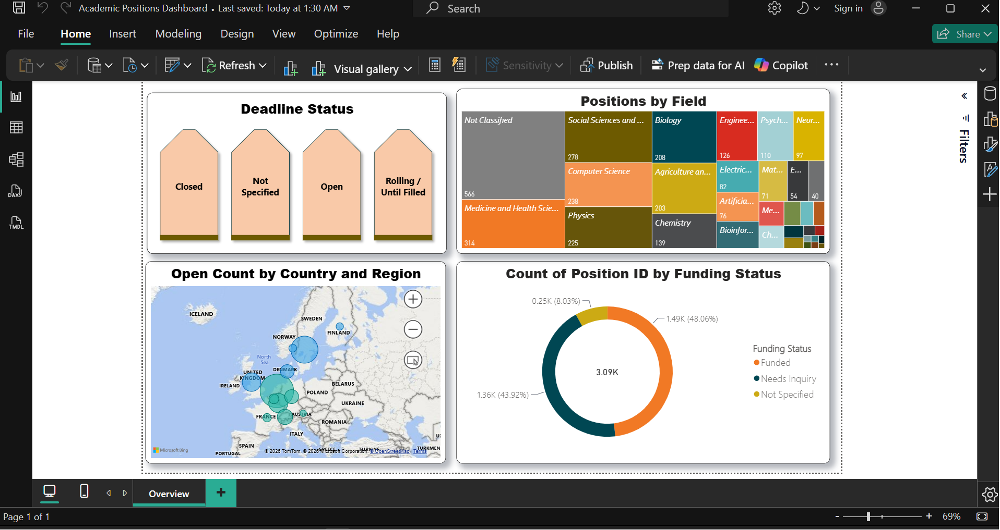

# Academic Positions Dashboard

An interactive Power BI report built on a snapshot of 3,090 PhD and postdoc positions across 20+ countries, drawn from the Apply Abroad Lab academic positions database.



## What the page shows

| Visual | What it answers |
| --- | --- |
| **Deadline Status** (button slicer) | How many positions are Open, Closed, Rolling / Until Filled, or have no stated deadline |
| **Positions by Field** (treemap) | Which disciplines carry the most positions, from Not Classified and Medicine down to niche fields |
| **Open Count by Country and Region** (map) | Where currently open positions are concentrated, focused on Europe |
| **Count of Position ID by Funding Status** (donut) | The split between Funded (48%), Needs Inquiry (44%), and Not Specified (8%) positions |

Every visual cross-filters the others. Selecting a deadline status, a field in the treemap, or a country on the map updates the whole page.

## Data model

Star schema with one fact table (`Positions`) and five dimensions: `Countries`, `Fields`, `Institutions`, `Dates`, `LivingCosts`. Relationships are many-to-one from `Positions` to each dimension.

Key DAX measures:

```dax
Funded Count = CALCULATE(COUNTROWS(Positions), Positions[Is Funded] = TRUE)

Open Count = CALCULATE(
    COUNTROWS(Positions),
    Positions[Deadline Status] IN {"Open", "Rolling / Until Filled"}
)

Countries Covered = DISTINCTCOUNT(Positions[Country Code])
```

The map is filtered to the four European regions in the `Countries[Region]` column (Northern, Western, Eastern, Southern Europe).

## Files

| File | Purpose |
| --- | --- |
| `Academic Positions Overview.pbix` | The Power BI report, data included (Import mode) |
| `Academic Positions Power BI Dataset.xlsx` | The source snapshot the report was built from, one sheet per table |
| `screenshot.png` | Static preview of the page |

## How to open

1. Install [Power BI Desktop](https://powerbi.microsoft.com/desktop/) (free, Windows).
2. Download `Academic Positions Overview.pbix` and open it.
3. No data connection is needed, the dataset is embedded in the file.

## Data source

Positions are collected from public university and research-institute listings as part of the Apply Abroad Lab advisory practice. The snapshot contains position metadata only: title, institution, country, field, degree level, deadline, and funding status. No personal or contact data is included.

## License

Report and documentation are released under the MIT License (see `LICENSE`). The dataset snapshot is shared for review and portfolio purposes.

## Author

**Ali Soltanhosseini**
Data Analyst, International Academic Advising

- [databizex.com](https://databizex.com)
- [linkedin.com/in/ali-soltanhosseini-aut](https://www.linkedin.com/in/ali-soltanhosseini-aut/)
- a.soltanhosseini@gmail.com
